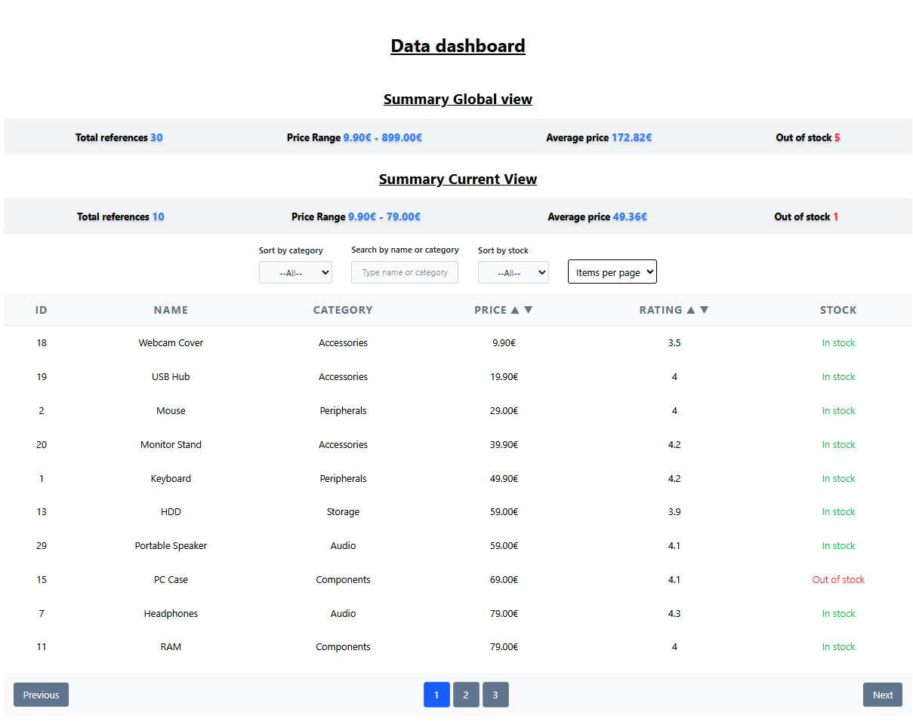

# Data Dashboard – Vanilla TypeScript + Vite

<div style="text-align:center">

</div>

### Présentation du projet

Ce projet est un **tableau de bord de données interactif** construit de zéro en utilisant **TypeScript**, **Vite** et **Tailwind CSS**. Il a été conçu comme un exercice de révision pour consolider les fondamentaux de la programmation web sans aucun framework frontend.

L'objectif est de démontrer une maîtrise des **API du navigateur**, des **modules ES** et d'une architecture de code propre et modulaire.

---

## Fonctionnalités principales

| Catégorie        | Description                                                                             |
| :--------------- | :-------------------------------------------------------------------------------------- |
| **Tri**          | Tri de données dynamique (numérique et textuel) en cliquant sur l'en-tête de colonne.   |
| **Filtres**      | Recherche par texte avec délai (debounce) et filtres par catégorie ou stock.            |
| **Pagination**   | Navigation optimisée entre les pages, avec une taille d'affichage configurable.         |
| **Statistiques** | Affichage de résumés dynamiques : prix moyen, prix min/max, nombre d'articles en stock. |

---

## Architecture et technologies

- **TypeScript** : pour un code robuste, sûr et facile à maintenir.
- **Vite** : pour un environnement de développement rapide et moderne.
- **Tailwind CSS** : pour un design minimaliste et modulaire sans dépendances de composants.
- **API du navigateur** : Utilisation exclusive du DOM et des modules ES.

Le code est organisé de manière modulaire :

- `logic/` : contient les fonctions de traitement de données (tri, filtrage, pagination).
- `core/` : gère l'état global de l'application et les utilitaires.
- `ui/` : responsable de la création et de la mise à jour des composants de l'interface.

---

## Démarrage rapide

1.  **Cloner le projet :**

    ```bash
    git clone https://github.com/votre-utilisateur/data-dashboard.git
    cd data-dashboard
    ```

2.  **Installer les dépendances :**

    ```bash
    npm install
    ```

3.  **Lancer l'application en mode développement :**

    ```bash
    npm run dev
    ```

4.  **Construire la version de production :**

    ```bash
    npm run build
    ```

---

## Perspectives et évolutions futures

- Consommation de données depuis une API REST.
- Persistance de l'état de l'interface dans le stockage local du navigateur.
- Ajout de graphiques de données pour une visualisation plus avancée.

---

## Licence

Ce projet est sous **licence MIT** – libre d’utilisation, de modification et de distribution.
